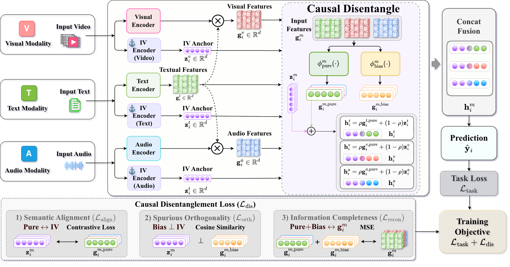

# IVID: Instrumental Variable-Inspired Disentanglement for MSA

Instrumental Variable-Inspired Disentanglement (IVID) is a multimodal sentiment
analysis framework for CMU-MOSI and CMU-MOSEI. It addresses two sources of bias
in multimodal fusion: exogenous gaps across text, audio, and video feature
spaces, and endogenous bias introduced by cross-modal interaction.

## Contents

- [Method Overview](#method-overview)
- [Repository Layout](#repository-layout)
- [Environment](#environment)
- [Configuration](#configuration)
- [Data Preparation](#data-preparation)
- [Quick Start](#quick-start)
- [Training Options](#training-options)

## Method Overview

IVID first uses text-guided attention to align non-text modalities with the
dominant textual signal. It then builds independent unimodal representations as
IV-inspired semantic anchors and disentangles each guided representation into a
causal semantic component and a bias component. The semantic component is aligned
with the independent anchor, the bias component is encouraged to be orthogonal to
the anchor, and both components reconstruct the original guided representation.
The final prediction uses the purified component together with its IV anchor.



## Repository Layout

```text
.
|-- README.md
|-- run.py                 # training entry point
|-- extract_audio.py       # audio extraction helper for raw videos
|-- requirements.txt       # Python dependencies
|-- configs/
|   `-- ivid.yaml          # default training configuration
|-- figures/
|   |-- head.png           # problem and high-level IVID illustration
|   `-- main.png           # IVID framework figure
`-- utils/
    |-- __init__.py
    |-- attention_layers.py # text-guided and self-attention blocks
    |-- config.py          # config dataclass and YAML loader
    |-- data_loader.py     # MOSI/MOSEI text, audio, and video data loader
    |-- en_train.py        # training loop, validation, early stopping
    |-- ivid_model.py      # IVID model implementation
    `-- metricsTop.py      # MOSI/MOSEI regression metrics
```

## Environment

```bash
conda create -n ivid python=3.8 -y
conda activate ivid
pip install -r requirements.txt
```

The model uses `roberta-large` and `facebook/data2vec-audio-large-960h`, which
are downloaded automatically by Hugging Face Transformers on first use.

## Configuration

Default training settings live in `configs/ivid.yaml`. The training entry point
loads this YAML file first and then applies command-line overrides. Important
fields include:

```yaml
dataset_name: mosi
batch_size: 8
learning_rate: 5.0e-6
epochs: 30
patience: 8
pure_weight: 0.1
bias_weight: 0.1
complete_weight: 0.1
```

## Data Preparation

Download CMU-MOSI and CMU-MOSEI from the following link:

```text
https://drive.google.com/drive/folders/1A2S4pqCHryGmiqnNSPLv7rEg63WvjCSk
```

Arrange the files as follows:

```text
data/
  MOSI/
    label.csv
    Raw/
    wav/
    Processed/
      unaligned_50.pkl
  MOSEI/
    label.csv
    Raw/
    wav/
    Processed/
      unaligned_50.pkl
```

If `wav/` has not been generated yet, extract audio from the raw videos:

```bash
python extract_audio.py --dataset mosi
python extract_audio.py --dataset mosei
```

The video feature file `Processed/unaligned_50.pkl` should contain FACET-style
features with the split keys `train`, `valid`, and `test`, each providing `id`
and `vision` entries.

## Quick Start

Train on CMU-MOSI:

```bash
python run.py --config configs/ivid.yaml
```

Train on CMU-MOSEI:

```bash
python run.py --config configs/ivid.yaml --dataset mosei
```

Defaults are defined in `configs/ivid.yaml`, including `batch_size=8`,
`learning_rate=5e-6`, `epochs=30`, and `patience=8`. The best checkpoint is
saved to `checkpoint/ivid_<dataset>_seed<seed>.pt`, and logs are written to
`logs/ivid.log`.

Validation and test reports use the non-zero binary setting by default: `Acc`
and `F1` correspond to the original non-zero Acc-2 and F1 metrics. The report
also includes `Mult_acc_5`, `Mult_acc_7`, `MAE`, and `Corr`.

## Training Options

Common options:

```bash
python run.py \
  --config configs/ivid.yaml \
  --dataset mosi \
  --seed 1 \
  --batch_size 8 \
  --lr 5e-6 \
  --epochs 30 \
  --patience 8 \
  --pure_weight 0.1 \
  --bias_weight 0.1 \
  --complete_weight 0.1
```

Command-line arguments override fields loaded from the YAML config. For a
reproducible run, prefer editing or copying `configs/ivid.yaml` and then using
CLI arguments only for small run-specific overrides such as `--dataset` or
`--seed`.

Loss weights correspond to the three disentanglement terms:

```text
--pure_weight      semantic alignment with the IV anchor
--bias_weight      orthogonality between bias and IV anchor
--complete_weight  reconstruction of the guided representation
```

`--recon` is kept only for backward compatibility. When it is non-zero, it sets
all three disentanglement weights to the same value.
